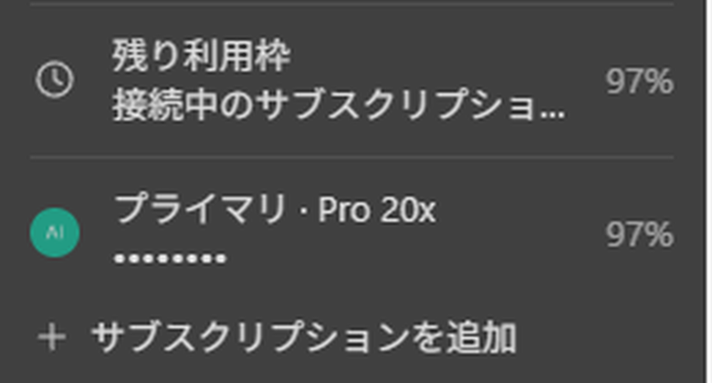

# Codex Subscription Router



複数の ChatGPT サブスクリプションを、1 つの独立した Windows デスクトップアプリから使う。

Codex Subscription Router は公式 ChatGPT デスクトップアプリのローカルなパッチ済みコピーを作成し、
新しいチャットを接続済みのサブスクリプションへ分散させる。各スレッドは 1 つのサブスクリプションに
固定されるため、続きの発言でも会話コンテキストが維持され、アカウント単位のキャッシュが効く。

公式アプリはビルド入力として読み取るだけで、決して変更しない。このリポジトリにはソースコードと
ビルドツールのみが含まれ、OpenAI のバイナリや配布可能なアプリは含まれない。

本リポジトリは [b-nnett/codex-subscription-router](https://github.com/b-nnett/codex-subscription-router)
の fork である。オリジナルは macOS 版として設計・実装されており、本 fork はそれを Windows 版へ
移植し、日本語化したものである。設計の中核は上流の成果であり、詳しくは [謝辞](#謝辞) を参照。

> [!WARNING]
> 本プロジェクトは非公式で、公式ビルドのバージョンに強く依存する。OpenAI とは無関係であり、
> サポートも受けられない。利用前にソースを確認し、接続する各サブスクリプションに適用される
> 規約に適合するかを自分で判断すること。


## 主な機能

- **利用枠を考慮したルーティング。** 新しいチャットは、先に失効する週次利用枠を優先し、
  貯まっているリセットクレジットに上限付きの加点を与えて割り当てる。
- **スレッドの固定。** 一度割り当てたスレッドは、その枠を使い切らない限り常に同じ
  サブスクリプションへ送られる。
- **自動フェイルオーバー。** 枠を使い切ったスレッドは、余力のある別アカウントで継続する。
  プール全体が空の場合は、まとめた 1 件のアラートを表示する。
- **ネイティブなアカウント管理。** 既存のプロフィールメニューに、合算利用量・プロフィール写真・
  プラン名・マスクされたメールアドレス・デバイスコードサインインを表示する。
- **アカウント別のリセット。** ネイティブのレート制限シートで、選択したサブスクリプションの
  リセットクレジットを表示・消費する。
- **合算プロフィール。** プロフィール設定の統計を全サブスクリプションで合算し、接続中の
  アカウントを重ねて表示する。
- **サブスクリプションの追加と削除。** デバイスコードでのサインインに加え、既存の
  `auth.json` をインポートして追加できる。削除したアカウントのデータは復元可能な
  バックアップへ退避する。
- **日本語 UI。** 注入する UI はすべて日本語。アプリ本体も Windows の表示言語に従い日本語で動作する。

## 仕組み

パッチ済みデスクトップは従来どおり app-server 接続を 1 本だけ開く。小さな Go 製の多重化プロキシが
その接続をアカウントごとの公式 Codex 子プロセスへ分配する。各子プロセスは隔離された Codex ホームを
持ち、多重化プロキシがスレッドごとの所有アカウントを記録する。

```text
Codex Subscription Router (CodexSubscriptionRouter.exe)
        │
        │ app-server 接続 1 本
        ▼
    resources\codex.exe  (Go 多重化プロキシ)
    ├── プライマリ            → %USERPROFILE%\.codex
    ├── サブスクリプション 2  → 隔離された Codex ホーム
    └── サブスクリプション 3  → 隔離された Codex ホーム
             │
             └── スレッド ID → 所有アカウントを永続化
```

公式の `codex.exe` は `codex.real.exe` として同じディレクトリに保持され、多重化プロキシから
子プロセスとして起動される。`app-server` 以外の呼び出しはそのまま素通しする。

詳細は [アーキテクチャ](docs/ARCHITECTURE.md) と
[セキュリティモデル](docs/SECURITY-MODEL.md) を参照。

## 対応環境

| 項目 | 対応値 |
| --- | --- |
| OS | Windows 11 (x64) |
| 公式 ChatGPT デスクトップ | MSIX パッケージ `OpenAI.Codex` `26.818.8289.0` |
| Go | 1.26 以上 |
| Node.js | 22.12 以上 |
| Python | 3.11 以上 |

パッチャーは公式アプリのバージョンと `app.asar` の SHA-256、および書き換える全アンカーを
事前に検証する。未知の上流ビルドは既定で拒否し、部分的なパッチを当てない。記録済みのハッシュは
[対応状況](docs/COMPATIBILITY.md) を参照。

Windows 版は macOS 版と異なり、コード署名も ASAR 整合性ハッシュの更新も不要である。公式ビルドの
Electron fuse `EnableEmbeddedAsarIntegrityValidation` が無効化されているため、再パックした
`app.asar` はそのまま読み込まれる。

## 前提

- Microsoft Store 版の公式 ChatGPT デスクトップアプリ
- Go 1.26 以上
- Node.js 22.12 以上と npm
- Python 3.11 以上

```powershell
winget install --id Git.Git
winget install --id GoLang.Go
winget install --id OpenJS.NodeJS.LTS
winget install --id Python.Python.3.12
```

## インストール

PowerShell で次を実行する。ソースの取得・更新、固定されたビルド依存の導入、独立アプリの作成、
起動までを 1 コマンドで行う。

```powershell
irm https://raw.githubusercontent.com/developer-nagi/codex-subscription-router-ja/main/install.ps1 | iex
```

インストーラはソースを `%USERPROFILE%\.codex-subscription-router\source` に保持する。既存の
インストールがある場合はアカウント状態を引き継ぎ、復元可能なバックアップを作成する。前提条件や
上流互換性の検査に失敗したときは、部分的なインストールを作らずに明確なメッセージで停止する。

> [!TIP]
> 実行前に内容を確認するには [`install.ps1`](install.ps1) を開くか、パイプせずにダウンロードする。

### クローンからインストール

```powershell
git clone https://github.com/developer-nagi/codex-subscription-router-ja.git
cd codex-subscription-router-ja
npm ci --ignore-scripts
python scripts/patch_app.py
```

作成されるもの:

- `%LOCALAPPDATA%\Programs\Codex Subscription Router`
- スタートメニューのショートカット「Codex Subscription Router」
- `%APPDATA%\Codex Subscription Router` 配下の独立したデスクトッププロファイル

公式アプリと同時に起動できる。プロファイルとユーザーデータが分離されているため、互いに影響しない。

## サブスクリプションを追加する

1. サイドバー下部のプロフィールメニューを開く。
2. **サブスクリプションを追加** を選び、追加方法を選ぶ。
   - **ChatGPT でサインイン** — 表示されたデバイスコードでブラウザからサインインする。
     アカウント側で Codex のデバイスコード認証が有効である必要がある。
   - **auth.json をインポート** — 既存の Codex ログインファイルを読み込む。
     デバイスコード認証を使えない場合はこちらを選ぶ。
3. アプリに戻り、アカウント行が現れるのを待つ。

コード表示中はメニュー外をクリックしても閉じない。コードをクリックするとコピーされ、
確認ページが開く。

プロフィールメニューには合算の週次利用量に続いて、サブスクリプションごとの行が並ぶ。
メールアドレスはホバーするまでマスクされる。最終行から常に追加のサインインを開始できる。

**サブスクリプションを管理** を選ぶと各行が削除操作になる。プライマリは削除できない。
削除するとチャットはただちにアプリから消えるが、アカウントのデータは
`%USERPROFILE%\.codex-muxackupsccounts` へ退避されるため復元できる。サインインが
完了しなかったアカウントも管理モードでは表示され、ここから片付けられる。

## ルーティングの挙動

| 状況 | 挙動 |
| --- | --- |
| 新しいチャット | 失効が近い利用枠、貯まったリセット、短期枠の逼迫度で割り当て |
| 続きの発言 | そのスレッドに永続化された所有アカウントへ送る |
| 所有アカウントが枯渇 | 余力のある別アカウントで継続 |
| 全アカウントが枯渇 | 次回リセット時刻を含む 1 件のアラート |
| アカウントを無効化 | ルーティングと合算利用枠から除外 |
| 独自プロバイダまたは OpenAI 以外のベース URL | 合算 ChatGPT 利用枠を使わず、そのアカウントに設定された Codex プロバイダへ送る |

## 更新と再ビルド

コピーしたアプリの自動更新経路は公式 MSIX パッケージから切り離されているため、Store 側の更新で
パッチ済みコピーが上書きされることはない。公式アプリを更新したあと、その新しいビルドが
対応表に載っていることを確認してから再ビルドする。

```powershell
python scripts/patch_app.py --force
```

先に Codex Subscription Router を終了しておく。既存のインストールは
`%USERPROFILE%\.codex-mux\backups` 配下のタイムスタンプ付きディレクトリへ退避される。アカウント状態と
資格情報はアプリ本体の外に保存されるため、そのまま維持される。再ビルドしたアプリの動作確認後に、
古いバックアップは手動で削除する。

## ローカルデータとセキュリティ

| パス | 用途 |
| --- | --- |
| `%USERPROFILE%\.codex` | プライマリの資格情報・会話・キャッシュ |
| `%USERPROFILE%\.codex-mux\state.json` | アカウント情報とスレッド所有の永続化 |
| `%USERPROFILE%\.codex-mux\accounts\<id>\codex-home` | 隔離されたセカンダリアカウントのデータ |
| `%USERPROFILE%\.codex-mux\control-token` | ループバック限定の制御サービス用トークン |
| `%USERPROFILE%\.codex-mux\backups` | 復元可能なアプリのバックアップ |
| `%APPDATA%\Codex Subscription Router` | 独立したデスクトッププロファイル |

制御サービスは `127.0.0.1` にのみバインドし、非公開経路をランダムな 256 ビットトークンで保護する。
OAuth トークンは各アカウントの Codex ホーム内に留まり、制御 API から返されることはない。
状態ディレクトリの ACL は継承を切り、現在のユーザーのみに限定する。

プラグイン構成は意図的にプライマリアカウントから同期される。共有 MCP 構成に埋め込まれた秘密情報は
各隔離アカウントのホームへコピーされるため、アカウントディレクトリは秘密情報の分離境界ではない。

資格情報・署名・ローカル制御サービスに関する問題は [SECURITY.md](SECURITY.md) を先に読むこと。

## 開発と検証

```powershell
npm ci --ignore-scripts
npm run check
npm run release:check
```

Go バックエンドと注入するレンダラーには実行時のサードパーティ依存がない。`@electron/asar` は
ビルド時のみ使う。決定的な UI プレビュー経路は、起動時に `CODEX_MUX_UI_TESTS=1` がある場合のみ
有効になり、常にトークン認証を要求する。

実機での確認手順は [SMOKE-TEST.md](docs/SMOKE-TEST.md) にある。

## 既知の制限

- 上流の ChatGPT 更新により、レンダラーのアンカーを再導出する必要が生じる場合がある。
  アンカーはビルドごとの minify 結果に依存し、バージョン間で互換性がない。
- macOS 版にあった以下の機能は、Windows 版で該当画面の実装が変わったため未移植:
  プロフィール設定でアカウントを選んで個別統計を見る機能、設定 → プラグインのサブスクリプション
  切り替え、スレッド要約の「サブスクリプション」欄。合算プロフィールの表示そのものは動作する。
  詳細と現状は [対応状況](docs/COMPATIBILITY.md) を参照。
- 初回の履歴統合取得はアカウントあたり 500 スレッドまで。
- 合算の「探索したスキル」はアカウントごとに同じスキルを重複計上しうる。上流のプロフィール応答が
  スキル ID ではなく件数を返すため。
- 配布はソースのみ。パッチ済みの OpenAI バイナリを配布することはない。

## fork 元の変更を取り込む

本 fork は fork 元 (macOS 版) と大きく分岐しているため、`git merge upstream/main` は使わない。
上流の変更はコミット単位で確認し、必要なものだけを適用する。

```powershell
npm run upstream:check -- --fetch
```

未確認の上流コミットを列挙し、変更ファイルを「取り込み候補 / 要注意 / 対象外」に分類する。
分岐元が古い上流ブランチも警告する。手順と判断の記録は
[UPSTREAM-SYNC.md](docs/UPSTREAM-SYNC.md) と `scripts/upstream-sync.json` にある。

## コントリビューションとリリース

変更を送る前に [CONTRIBUTING.md](CONTRIBUTING.md) を読むこと。リリースは
[RELEASING.md](docs/RELEASING.md) のソース限定手順に従い、対象コミットでの実機確認を必須とする。

## 謝辞

本プロジェクトは Bennett Blackham 氏による
[codex-subscription-router](https://github.com/b-nnett/codex-subscription-router)
を出発点としている。次の設計と実装はいずれも上流の成果であり、本 fork はそれを受け継いでいる。

- 1 本の app-server 接続をアカウントごとの Codex 子プロセスへ分配する多重化アーキテクチャ
- 週次利用枠の失効までの猶予とリセットクレジットで新規チャットを割り当てる設計
- スレッドを 1 つのサブスクリプションへ固定し、枯渇時にだけ引き継ぐ方針
- アカウントごとに Codex ホームを隔離し、管理対象の構成だけを共有する仕組み
- 期待するアンカーが 1 つでも欠けたら停止する fail-closed のパッチ方針
- ループバック限定・トークン認証の制御 API と、その周辺のセキュリティ設計

本 fork が加えたのは、プラットフォームを Windows へ置き換えたことと日本語化であり、
上記の考え方そのものは変更していない。優れた土台を公開してくださったことに感謝する。

上流は macOS 版として開発が続いている。macOS を使う場合は本 fork ではなく
[オリジナル](https://github.com/b-nnett/codex-subscription-router) を利用すること。
本 fork の不具合や要望を上流へ持ち込まないよう注意する。

## ライセンス

本プロジェクトのソースは [MIT License](LICENSE) で提供する。著作権表示は
オリジナルの著作者である Bennett Blackham 氏のものを保持している。

ChatGPT、Codex、および公式の Windows アプリは OpenAI の製品であり、本ライセンスの対象外である。
